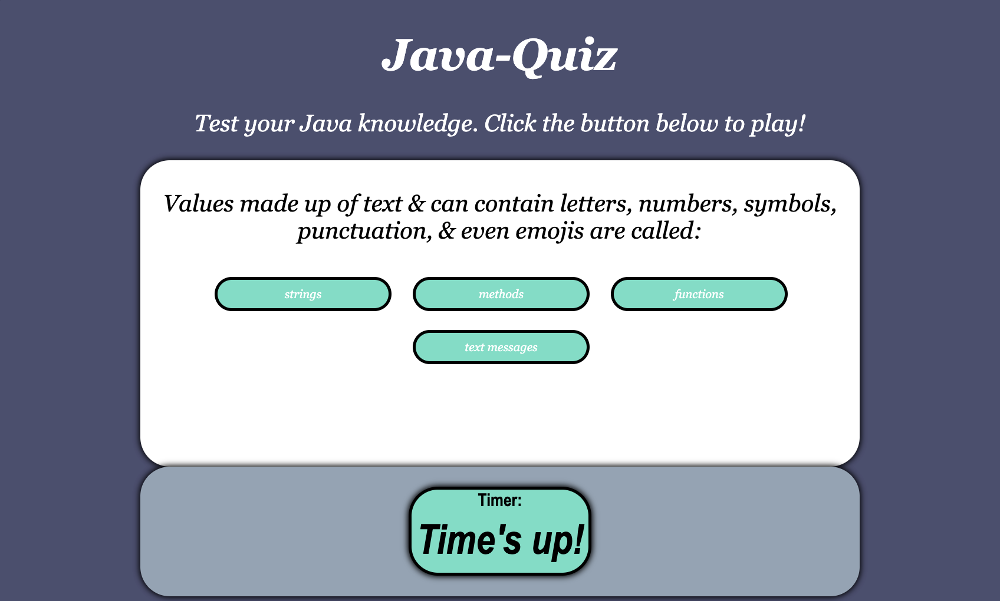

# java-quiz

This is Java-quiz. Let me test your javascript knowledge! The goal was to create a quiz with HTML, CSS, and Javascript. The user is presented with one question at a time after they click a start button. When the user selects an answer they are then presented with the next question. There is a timer and a scoreboard. If the user answers the question wrong time is deducted from the clock. The user loses if time runs out. When the guiz is over the user is directed to a highscore page where they can enter their initials.

URL: https://ktmac21.github.io/java-quiz/

